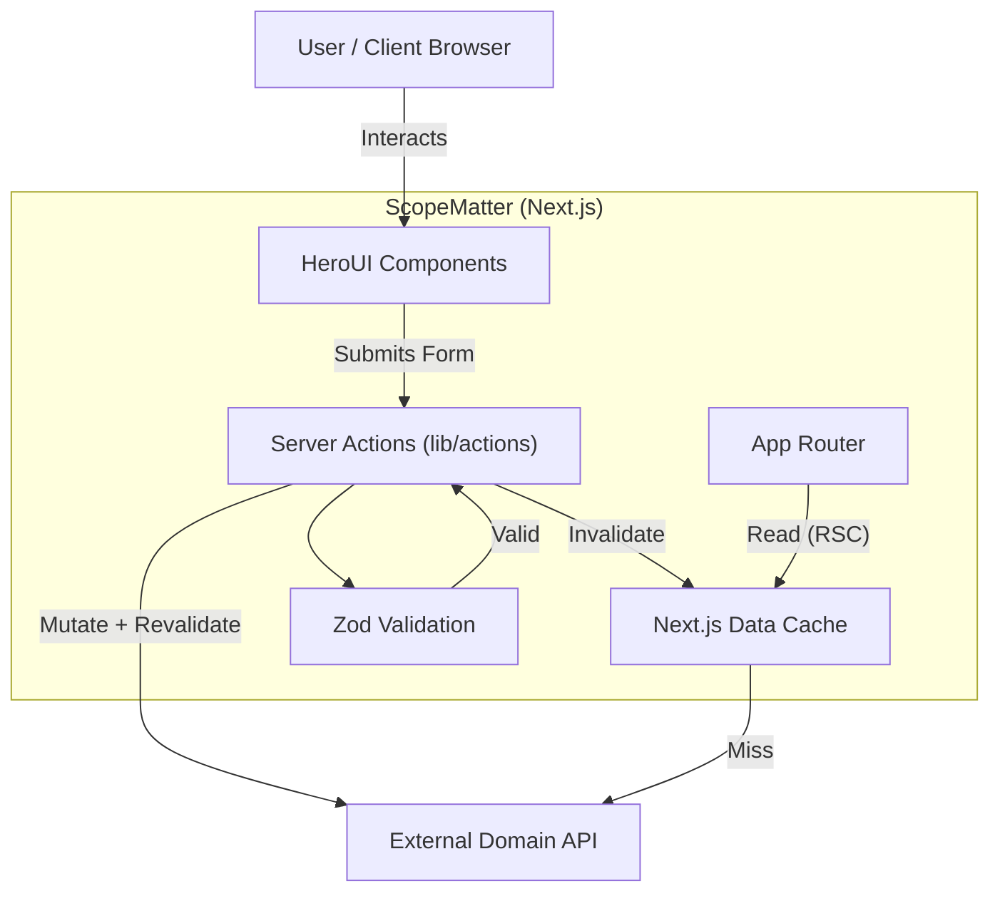
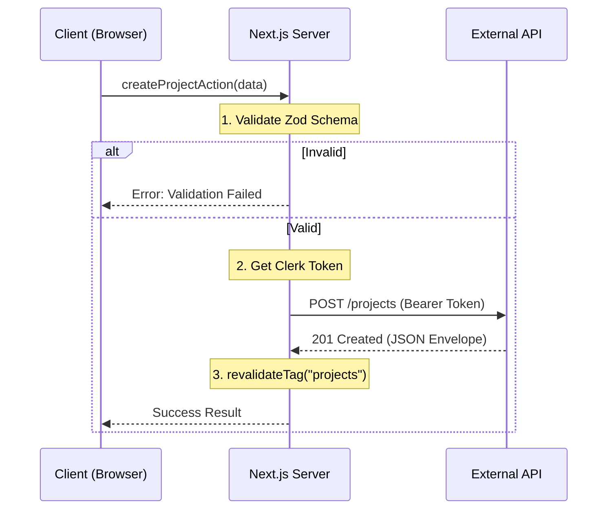

# Architecture & Trust Engine

> **"Software architecture is the art of drawing lines that I mean to adhere to."**

This document serves as the cognitive map for the **ScopeMatter** application. It describes the physical boundaries, the mental models used to traverse them, and the engineering principles that govern the evolution of this system.

---

## 1. System Overview

**ScopeMatter** is designed as a modern **Backend-for-Frontend (BFF)** architecture using **Next.js App Router**. It does not own the persistence layer; instead, it acts as a secure, type-safe orchestrator between the client experience and an upstream Domain API.

### High-Level Components

- **Experience Layer (Client)**: Built with **HeroUI (v2)**, **Framer Motion**, and **Tailwind CSS**. It focuses purely on interaction and state presentation.
- **Orchestration Layer (Next.js Server)**: Leveraging **Server Actions** and **React Server Components (RSC)**. This layer handles validation, authentication injection, and caching strategies.
- **Domain Layer (External API)**: The source of truth. ScopeMatter consumes this JSON HTTP API, treating it as the primary data store.

### Mental Model: The "Envelope" Proxy

Every interaction with the upstream system is wrapped in a standardized **Envelope Pattern**. We do not simply "fetch data"; we ask the system to perform an `Action` or run a `Query`, and the result is strictly typed into an `ApiSuccess` or `ApiError` envelope. This normalization happens at the edge of our Next.js server, preventing downstream chaos.

---

## 2. Engineering Cognition (Trade-offs & Decisions)

### Trade-off A: Server Actions as the Sole Mutation Gateway

- **Context**: We could have allowed Client Components to `fetch()` the external API directly using Clerk tokens.
- **Decision**: We force **all mutations** through Next.js Server Actions (`lib/actions/*`).
- **Why?**:
  1.  **Cache Control**: Server Actions integrate natively with `revalidateTag`, allowing us to instantly stale the Next.js Data Cache (e.g., `["projects"]`) upon a successful mutation.
  2.  **Security Boundary**: API URLs and internal routing logic are hidden from the client bundle.
  3.  **Validation**: We run Zod validation on the Next.js server _before_ burdening the upstream API.

### Trade-off B: Duplicate Validation (The "Double-Gate" Strategy)

- **Context**: The upstream API undoubtedly validates data. We also validate it in `lib/validation/*`.
- **Decision**: We maintain strict Zod schemas in the frontend codebase.
- **Why?**: **Latency & UX**. Waiting for a round-trip to tell a user "Email is required" is unacceptable in a premium app. We catch 99% of errors at the edge (Next.js) or client-side, reserving the upstream API for business-logic validation only (e.g., "User already exists").

### Trade-off C: Custom HTTP Client vs. Generated SDK

- **Context**: We could use an OpenApi generator.
- **Decision**: We implemented a lightweight, manual `api()` wrapper in `lib/http/api.ts`.
- **Why?**: **Agility & Control**. Generated SDKs often bloat the bundle and struggle with Next.js-specific features like `next: { revalidate: ... }` and `auth()` headers. Our custom wrapper is <50 lines and deeply integrated with Clerk and the Next.js caching mechanism.

---

## 3. Data Flow Architecture

### Primary Workflow: Project Creation

This flow illustrates the "Secure Proxy" pattern used throughout the app.

1.  **Trigger**: User submits the "Create Project" form.
2.  **Client-Side Guard**: `react-hook-form` uses `zodResolver` to prevent submission of malformed basic types.
3.  **Server Action**: `createProjectAction(payload)` is invoked.
4.  **Edge Validation**: `handleAction` wrapper runs strict server-side Zod validation (`createProjectSchema`).
5.  **Auth Injection**: `api()` function retrieves the Clerk session token server-side and attaches `Authorization: Bearer ...`.
6.  **Upstream Request**: `POST /projects` is sent to the External API.
7.  **Cache Strategy**: On success (`200 OK`), `revalidateTag("projects")` is triggered, purging the cached list of projects.
8.  **UI Feedback**: The Server Action returns `ActionResult<CreateProjectOutput>`, and the UI redirects or updates optimistically.

---

## 4. Technical Depth & Integrity

### Security Patterns

- **Authentication**: Managed by **Clerk**. We never handle passwords. Session tokens are ephemeral and retrieved server-side for every upstream request.
- **Input Sanitization**: **Zod** is the firewall. No data leaves the Next.js server boundary without passing a schema check.
- **Error Normalization**: The `ApiException` class (`lib/http/exceptions.ts`) catches generic HTTP errors (404, 500) and converts them into structured Domain Errors, ensuring the UI always receives a predictable error shape.

### Directory Structure Philosophy

```
lib/
├── actions/      # MUTATION ENTRY POINTS (Server Actions)
├── validation/   # RULES OF ENGAGEMENT (Zod Schemas)
├── http/         # THE GATES (Fetch wrappers, Envelopes)
└── hooks/        # UI BEHAVIOR (React State)
```

This structure separates **Mechanism** (http) from **Intent** (actions/validation).

---

## 5. Visualizations

### High-Level Architecture



### Sequence Diagram: Secure Mutation



---

## 6. Compliance & Operations

### Zero-Friction Deployment

This application is designed for **Vercel** or any containerized environment.

- **Environment Variables**: Strictly typed in `config/env.ts` (implied pattern). The app explicitly fails to build if `NEXT_PUBLIC_API_URL` is missing.
- **Build Safety**: `tsc` and `eslint` run during build. We do not ship broken types.

### Local Sovereignty

- **Dependencies**: `npm install` is the only requirement.
- **Mocking**: The `api()` wrapper allows for easy interception if we ever need to run offline (future capability).
