# 🏗️ The Trust Engine Architecture

> **System Designation**: Sovereign Frontend Client (BFF)
> **Pattern**: "Gateway-Consumer"
> **Integrity Level**: High (Strict Type Safety & Envelope Compliance)

## 1. System Overview

This application serves as the **Autonomous Presentation Layer** for the ScopeMatter ecosystem. It is designed not as a simple website, but as a **Trust Engine** that enforces data integrity before information ever leaves the user's context.

The architecture strictly separates **Presentation State** (Client) from **Business Logic** (Remote API), bridged by a secure **Backend-for-Frontend (BFF)** layer powered by Next.js Server Actions.

```mermaid
graph TD
    classDef client fill:#e1f5fe,stroke:#01579b,stroke-width:2px;
    classDef bff fill:#e8f5e9,stroke:#1b5e20,stroke-width:2px;
    classDef external fill:#f3e5f5,stroke:#4a148c,stroke-width:2px,stroke-dasharray: 5 5;

    subgraph User Context ["🅰️ User Context (Browser)"]
        UI[React Components]:::client
        Hooks[Query Factory Hooks]:::client
    end

    subgraph Trust Anchor ["🛡️ Trust Anchor (Next.js Server)"]
        Actions[Server Actions]:::bff
        Validation[Zod Schema Guard]:::bff
        Session[Clerk Auth Token]:::bff
    end

    subgraph External World ["☁️ External Authority"]
        API[Remote REST API]:::external
    end

    UI -->|"Triggers Mutation"| Actions
    UI -->|"Subscribes (useQuery)"| Hooks
    Hooks -->|"Fetches via Proxy"| API
    Actions -->|"1. Validate Payload"| Validation
    Validation -->|"2. Attach Auth"| Session
    Session -->|"3. Forward Request"| API
    API -->|"4. Return Envelope"| Actions
    Actions -->|"5. Normalize Error/Success"| UI
```



## 2. Core Architectural Patterns

### 🛡️ The "Gateway" Pattern (BFF)
We treat the Next.js Server logic as a **Gateway**. All mutations (Writes) must pass through a `handleAction` wrapper.
*   **Purpose**: Prevents invalid data from ever reaching the external API.
*   **Implementation**: `lib/http/action.ts`
*   **Constraint**: UI components **NEVER** call `fetch` directly for mutations.

### ✉️ The "Envelope" Pattern
Communication is standardized. We do not deal in raw JSON; we deal in **Envelopes**.
*   **Purpose**: Eliminates "undefined is not an object" runtime errors by guaranteeing a response structure.
*   **Implementation**: `lib/http/envelope.ts`
*   **Contract**:
    ```typescript
    type ApiEnvelope<T> = 
      | { success: true, data: T, error: null }
      | { success: false, data: null, error: { message, code, details } }
    ```

### 🏭 The "Query Factory" Pattern
We do not use ad-hoc string keys for caching. We strictly define **Resource Factories**.
*   **Purpose**: prevents "cache bleeding" and creates a "Golden Path" for data fetching.
*   **Implementation**: `lib/http/query-factory.ts`
*   **Constraint**: `useQuery({ queryKey: ["users"] })` is **BANNED**. Must use `usersQuery.use()`.

## 3. Directory Cognition

We prioritize **Mental Models** over generic frameworks.

| Directory | Concept | Responsibility |
| :--- | :--- | :--- |
| `app/(rules)` | **The Law** | Layouts/Pages that enforce global access rules (e.g. Org selection). |
| `lib/http` | **The Bridge** | Transport layer logic (Envelopes, API Clients, Error Mapping). |
| `lib/actions` | **The Gatekeepers** | Server Actions that act as the BFF boundary. |
| `lib/validation` | **The Contract** | Zod schemas that define the absolute truth of data shapes. |
| `ui/` | **The Surface** | Pure visual components (Dumb UI). |

## 4. Security & Sovereignty

*   **Zero-Persistence**: This layer stores **no business data**. It is transient.
*   **Auth Proxying**: Auth tokens are exchanged server-side, never exposed to client-side JS if possible.
*   **Sovereign Build**: The `Dockerfile` is multi-stage, ensuring the production artifact contains 0% dev-dependencies.

---
*Architected by: Principal Software Architect (AI Orchestrated)*
